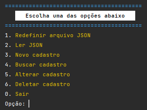

# CRUD com *arquivo.json*

Manipulação de arquivo JSON via Terminal.
Ferramentas de interação com *arquivo.json*:
- Gerar / criar;
- Ler;
- Consultar / Buscar;
- Alterar;
- Deletar.

## Como rodar o projeto:
Clone o repositório
```
git clone https://github.com/fabriciovale20/crud-json.git
```

Em seguida execute na IDE de sua preferência (VSCode, PyCharm...)


